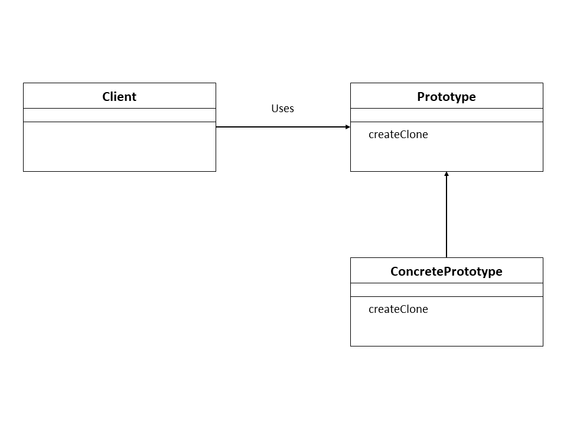

# Prototype


# Prototype


## 概要
Prototype は, オブジェクト生成をクラスを用いてではなく, 別のオブジェクトをコピーすることで実現するデザインパターンである.   

<p align="center">
  
<p>

なお Prototype は Python のビルトイン機能で実現可能である. 

## サンプルコード
x, y のプロパティを持つ ```Point``` クラスをコピーすることを考える. 

```shell
$ python3 src/main.py
result1:
x 2 2
y 3 3
result2(point1.x = 5):
x 5 2
y 3 3
```

### 一般的な書き方
- ```copy.deepcopy()``` : オブジェクトをコピーする. 

なお, ```copy.deepcopy()``` を用いずに ```point1 = point2``` のように代入形式にするとエイリアスが作られるだけでコピーにはならない. 

```shell
$ python3 src/main_assignment.py
result1:
x 2 2
y 3 3
result2(point1.x = 5):
x 5 5
y 3 3
```

このように, 代入形式では代入元の値が変更されると代入先の値まで変更されてしまう. 